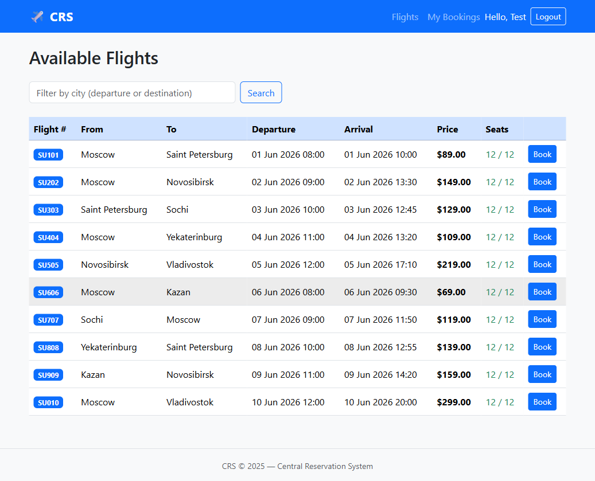
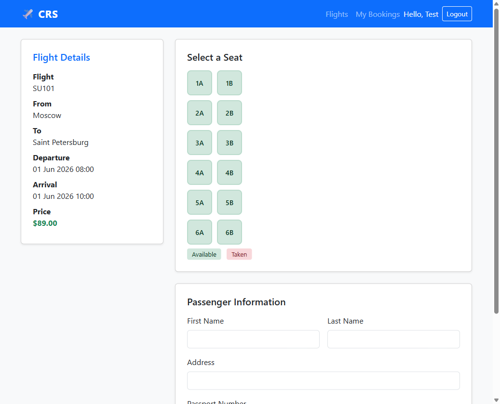

# CRS — Central Reservation System

A web-based flight booking system built with **FastAPI**, **SQLAlchemy**, and **Bootstrap 5**.

Originally a university coursework project in C# WinForms, rewritten as a modern Python web application.

## Screenshots

| Home Page | Available Flights | Seat Selection & Booking |
|:---:|:---:|:---:|
|  |  |  |

## Features

- User registration and login with **bcrypt** password hashing
- Browse available flights with **real-time city filter**
- Interactive **seat map** (2×6 grid) showing available and taken seats
- Book a flight with passenger details
- View and **cancel** your bookings
- Session-based authentication (secure cookie)
- Responsive UI with Bootstrap 5

## Tech Stack

| Layer    | Technology                      |
|----------|---------------------------------|
| Backend  | FastAPI + Jinja2 (SSR)          |
| Database | SQLite + SQLAlchemy 2.0         |
| Auth     | bcrypt + Starlette SessionMiddleware |
| Frontend | Bootstrap 5 + custom CSS        |

## Project Structure

```
web/
├── main.py              # FastAPI app, middleware, routes registration
├── database.py          # SQLAlchemy engine + session factory
├── models.py            # ORM models: User, Flight, Booking
├── auth.py              # Password hashing + session helpers
├── seed.py              # Seed 10 sample flights
├── requirements.txt
├── routers/
│   ├── auth.py          # /register  /login  /logout
│   ├── flights.py       # /flights  /book/{flight_number} GET
│   └── bookings.py      # /book/{flight_number} POST  /bookings  /bookings/{id}/cancel
├── templates/
│   ├── base.html
│   ├── home.html
│   ├── register.html
│   ├── login.html
│   ├── flights.html
│   ├── book.html
│   └── bookings.html
└── static/
    └── css/style.css
```

## Quick Start

```bash
cd CRS_System/web

# Install dependencies
pip install -r requirements.txt

# Seed sample flights
python seed.py

# Run the server
uvicorn main:app --reload
```

Open [http://localhost:8000](http://localhost:8000) in your browser.

## Routes

| URL | Method | Auth required | Description |
|-----|--------|---------------|-------------|
| `/` | GET | No | Home page |
| `/register` | GET/POST | No | Create account |
| `/login` | GET/POST | No | Sign in |
| `/logout` | POST | Yes | Sign out |
| `/flights` | GET | Yes | List flights (filterable by city) |
| `/book/{flight_number}` | GET | Yes | Booking form with seat map |
| `/book/{flight_number}` | POST | Yes | Confirm booking |
| `/bookings` | GET | Yes | My bookings |
| `/bookings/{id}/cancel` | POST | Yes | Cancel a booking |

## Improvements over original C# version

- Passwords are **hashed with bcrypt** (orignal stored plaintext)
- **Logout** functionality added
- **Filter** flights by departure or destination city
- **Flash messages** for booking confirmation and cancellation
- **Responsive** design (mobile-friendly)
- `CardNumber` removed — storing payment data is a PCI-DSS concern
- `created_at` timestamp on every booking
